# Block Civilization
**基于geth, web3js, vue的策略游戏DApp**


### 应用介绍

文明系列是一款优秀的战略战棋游戏，深受青年们的喜爱，因此我决定在区块链上实现文明游戏，相信能带来不一样的乐趣。

文明是个复杂的游戏，我在区块链上实现的是它的简化版本。

首先，每个文明拥有一定的城市，一开始随机生成一个城市。

城市拥有四个属性：人口（决定城市的特殊功能）、经济（决定城市行动的冷却时间）、政治（决定城市的扩张成功率）、军事（决定城市间交战的胜率）。

城市有两个主要的动作：扩张（发展、移民）和进攻。

城市进行扩张的时候，可以与另一个合约——世界进行交互，从世界获得相应的地形地貌信息（平原、丘陵、森林、沙漠等），在根据城市自身的政治属性计算。城市的扩张一定会触发发展，发展会一定程度增加城市的四个属性（具有随机性）；同时，如果城市政治足够高，会触发移民，玩家获得一个新的城市。

城市进行进攻的时候，会根据敌我城市的军事属性计算胜率，进攻成功，我方城市属性增强、敌方城市属性减弱（与双方经济相关，具有随机性），同时，有较小的概率占领地方城市；进攻失败，我方城市遭到削弱。

无论城市扩张或是进攻，还是使用吸收特技，都会触发一个冷却时间，在冷却时间内城市无法行动，冷却时间与城市的经济有关。

城市人口目前设计了两个特殊能力:
 - 改名：人口超过2的城市可以随意改名，无需冷却
 - 吸收：人口超过10的城市可以吸收另一个己方城市，被吸收者人口、属性下降，吸收者人口、属性上升，两者都会进入冷却状态，但总体收益稍微高一点

同时，游戏提供氪金功能，向合约部署者支付少量以太币，可以快速升级城市，无需冷却。

### 部署方法

测试运行环境：
 - Windows 10
 - geth
 - nodejs
 - chrome

`testnode`文件夹内，有预先设置好的节点，进入`node`文件夹

节点预设密码为**123**

`node1`
```bash
geth --datadir . console --identity "node1" --port "30303" --rpc --rpccorsdomain="*" --rpcport "8545" --rpcapi "db,eth,net,web3,miner,personal,admin" --networkid 15 --nodiscover --ipcdisable console
```

`node2`
```bash
geth --datadir . console --identity "node2" --port "30304" --rpc --rpccorsdomain="*" --rpcport "8546" --rpcapi "db,eth,net,web3,miner,personal,admin" --networkid 15 --nodiscover --ipcdisable console
```

`webapp`文件夹内

```bash
npm install
npm start
```

访问给定的端口即可

您也可以自行初始化节点，方法如下：

在`testnode`文件夹，新建`node3`文件夹，进入

```bash
geth --datadir . init ../genesis.json

geth --datadir . console --identity "node3" --port "30305" --rpc --rpccorsdomain="*" --rpcport "8547" --rpcapi "db,eth,net,web3,miner,personal,admin" --networkid 15 --nodiscover --ipcdisable console
```
注意端口要改变

创建新账号
```bash
personal.newAccount("123")
```
解锁账户
```bash
personal.unlockAccount(eth.accounts[0], "123")
```
挖点初始资金
```bash
miner.start()

miner.stop()
```

将`contract`文件夹的合约导入`remix-ide`，编译`civilization.sol`文件，在run标签卡选择web3 provider，输入http://localhost:8547（根据前面的配置改变端口号），deploy部署条约

```bash
miner.start()

miner.stop()
```
部署完成后将合约地址和合约api更新到`webapp/config/index.js`的`contractAddress`和`contractInterface`中，同时在geth中执行`admin.nodeInfo`，获得节点地址，加入`webapp/config/index.js`的`nodeInfo`数组中

### 运行效果

#### 功能效果

输入geth的rpc端口连接到节点，多个几点可以通过多个页面同时连接


前端界面

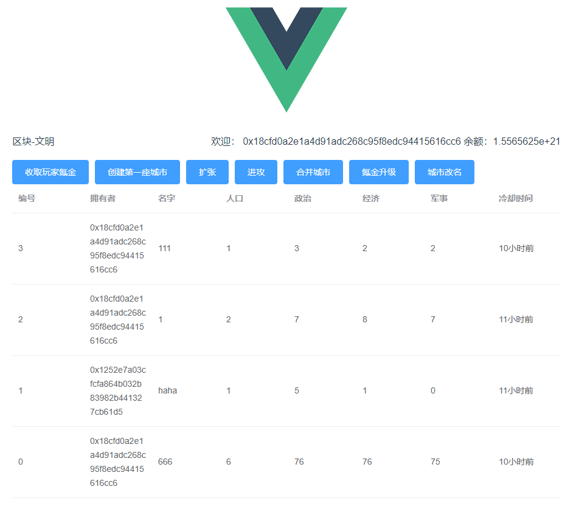

尝试扩张一座城市

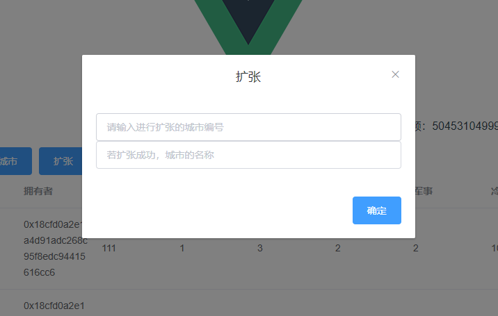

解锁节点账户（默认节点密码123）

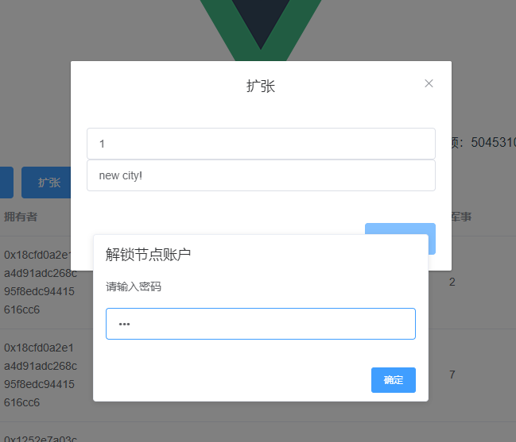

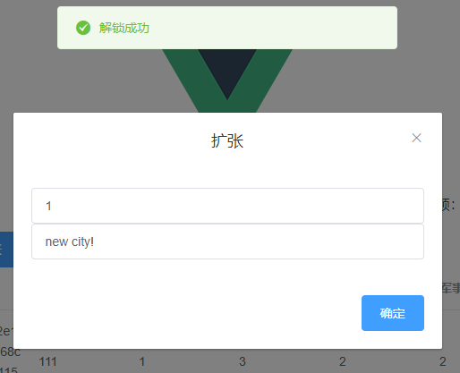

提交交易

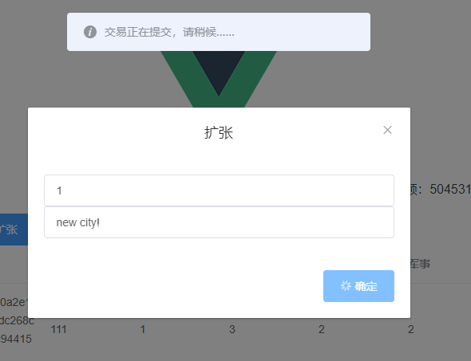

后台自动进行挖矿和停止

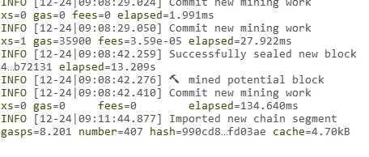

所有节点会同时收到扩张成功的提示

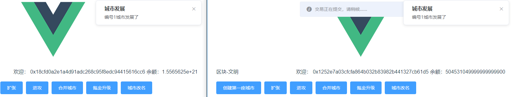

进攻城市


成功进攻，敌方城市削弱，我方城市增强

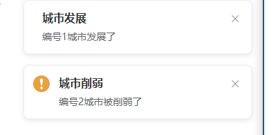

氪金升级，向合约部署者支付氪金费用，无视冷却时间，快速升级城市

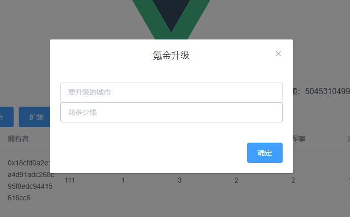

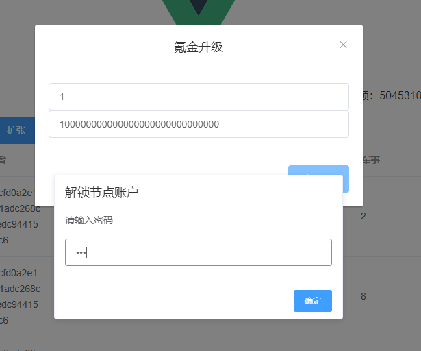


多余的氪金费用会退回

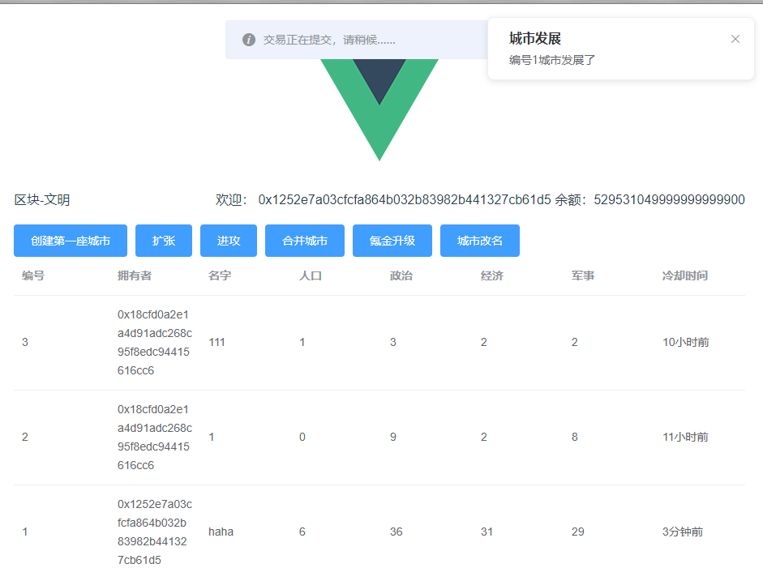

城市表格会实时更新

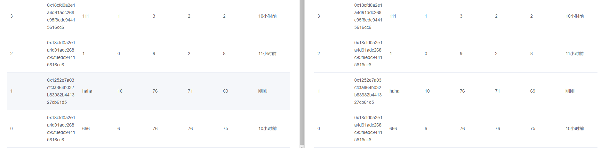


合并城市

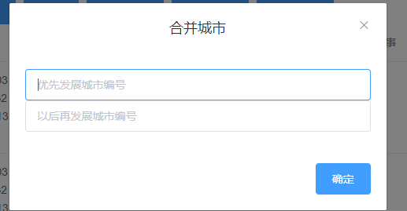

合并结果

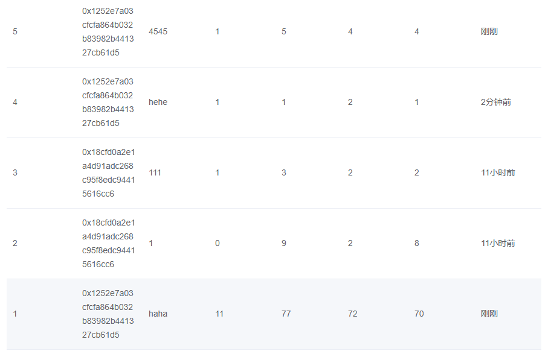


城市改名

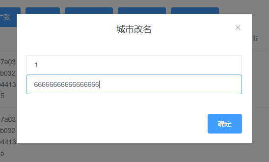

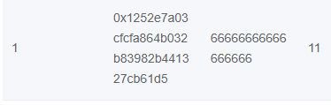

合约部署者可以收取玩家的氪金


#### 安全测试

尝试操纵别人的城市

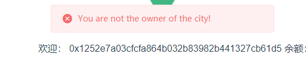

尝试在等级不够的时候，执行高级城市功能合并城市

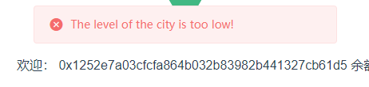

尝试氪金的时候少给钱

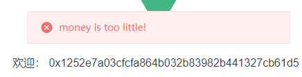

尝试在已经用于城市的时候再创建第一座城市

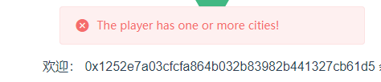
